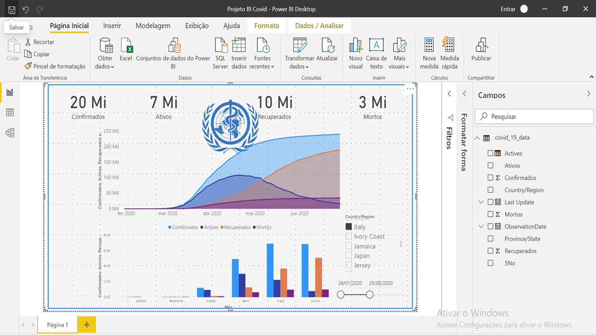
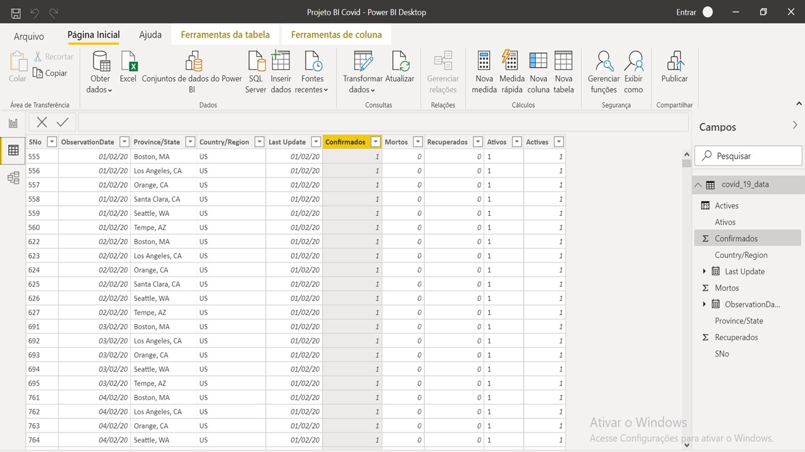

# Power-BI-Projetos---Covid-Italia

<h3>Situaçãodo projeto:</h3>

 O OMS reuniu dados de todo o mundo para análisar os casos infectados, casos ativos, indivíduos recuperados e número de óbitos por Covid-19. Coube aos setor responsável pela análise de dados elaborar um dashboard responsivo para ser usado como ferramenta de visualização voltada para qualquer tipo de usuário. Usando dados reais obtidos a partir do link https://www.kaggle.com/sudalairajkumar/novel-corona-virus-2019-dataset?select=covid_19_data.csv  o dashboard será elaborado focando no país Itália.

<h3>Screenshots:</h3>

    
<h3> Dificuldades encontradas:</h3>
  

 Alguns países apresentam dados que  são discrepantes ao serem comparados com outras fontes (dados do Brasil da fonte citada acima contra JHU CSSE COVID-19 ). Isso impossibilizou análisar outros países). 

## Autor

Desenvolvido por [**Hérick S. Müller**](https://www.linkedin.com/in/herick-muller/)
